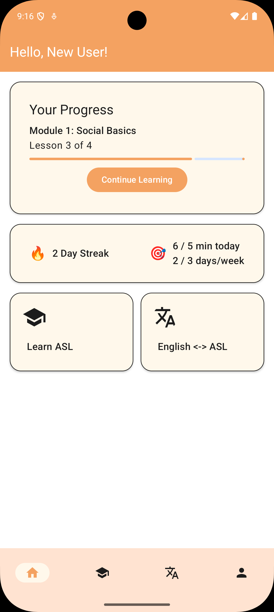
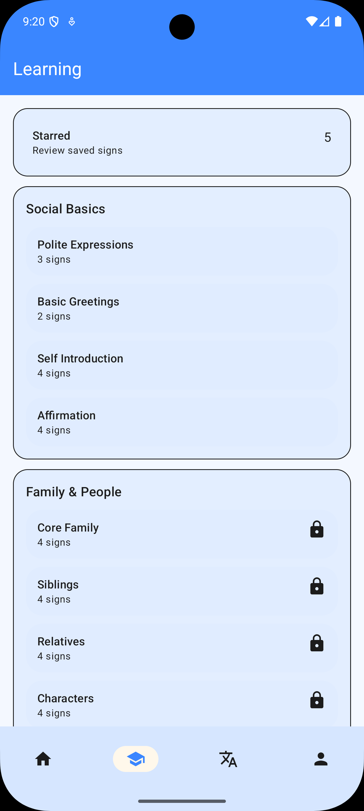
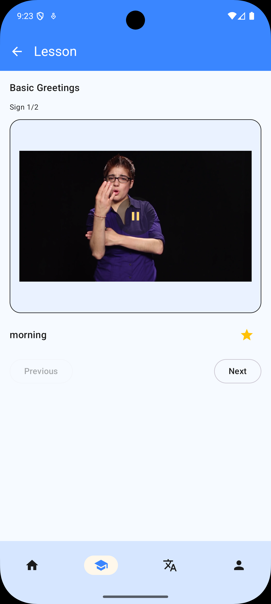
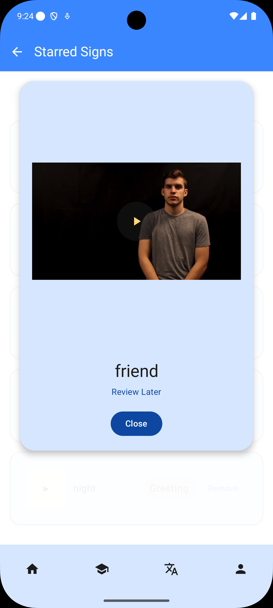
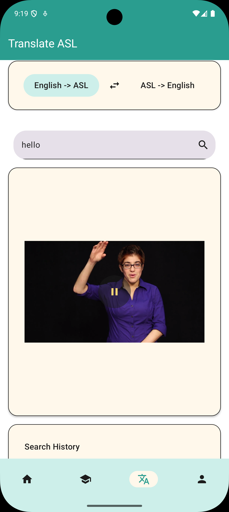
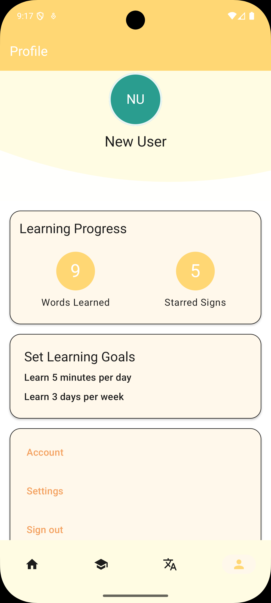
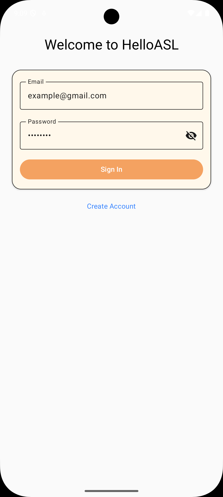
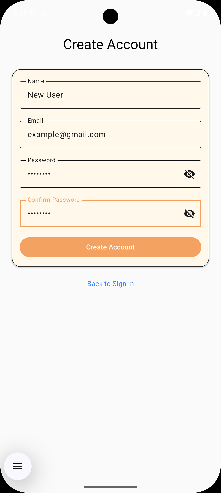

# CS 346 Group Project - Team 101-12

# HelloASL
The HelloASL app is a beginner-focused application designed to help users learn and practice commonly used American Sign Language (ASL) signs. The app also features two-way translation (English to ASL and ASL to English), allowing users to search for and communicate using sign language more effectively.

## Team Members
Name: Fangda Dai  Email: fdai@uwaterloo.ca

Name: Donghui Yu  Email: d9yu@uwaterloo.ca

Name: Tracy Hua   Email: t2hua@uwaterloo.ca 

Name: Mengdie Wu  Email: m283wu@uwaterloo.ca

## App Screens

### Home

### Learn

### Translate

### Profile

### Login

## Acknowledgements

We acknowledge the use of the following external resources in this project:

**WLASL Dataset** - https://dxli94.github.io/WLASL/
- Description: A large-scale video dataset of Word-Level American Sign Language (ASL) recognition.
- Contribution: Video samples from this dataset were used to create lesson materials and to support the English-to-ASL translation functionality in the application.

**VideoMAE WLASL100 Model** - https://huggingface.co/Shawon16/VideoMAE_Base_WLASL_100_200_epochs_p20_SR_8
- Description: An ASL video classification model based on the VideoMAE architecture, fine-tuned on the WLASL100 dataset for sign language recognition tasks.
- Contribution: Used to support the ASL-to-English recognition and translation functionality in the application.

## Releases

# Project Information

This is our Wiki https://git.uwaterloo.ca/m283wu/cs-346-group-project/-/wikis/home.

Our https://git.uwaterloo.ca/m283wu/cs-346-group-project/-/wikis/Team-Contract includes details on how we will work together.

The https://git.uwaterloo.ca/m283wu/cs-346-group-project/-/wikis/Project-Proposal describes our project idea and anticipated features.

Our https://git.uwaterloo.ca/m283wu/cs-346-group-project/-/wikis/Meeting-Notes record the details of our meetings throughout the term.

The https://git.uwaterloo.ca/m283wu/cs-346-group-project/-/wikis/Team-Reflections reflect our team’s development process, challenges, decisions, and lessons learned throughout the project.

# User Guide

## Getting Started

## Usage Guide

# Design Documents

This is our https://git.uwaterloo.ca/m283wu/cs-346-group-project/-/wikis/UML-ER-Diagram.

# Grading Instructions

### 1. Firebase Notification Setup

This app uses **Firebase Cloud Messaging (FCM)** to send push notifications on **Android**.

Note:
- Push notifications are supported on **Android only**.  
- Desktop builds do **not** receive notifications.

To-do:

1. Ask the project owner for the `google-services.json` file.

2. Place it here: `composeApp/google-services.json`

### 2. Connect to Supabase
To connect to the database, ask the project owner for `SUPABASE_URL` and `SUPABASE_ANON_KEY`, and add those to your local.properties file.

### 3. AI Model & Backend Server Setup
Our application uses a **Client-Server Architecture**. The sign language recognition is powered by a heavy VideoMAE model running on a local GPU server (NVIDIA 4060 Ti) to ensure fast inference. The Android app connects to this local server via an Ngrok secure tunnel.

#### **Option 1: Use Our Live Server (Recommended)**
We will try our best to keep the server running during the grading period. However, due to potential hardware sleep modes, ISP network resets, or Ngrok session timeouts, continuous uptime cannot be 100% guaranteed. 

**Step 1: Check Server Status**
Before testing the app, please click the link below to verify if our server is online:
[https://honeyless-militaristically-jeanett.ngrok-free.dev/docs](https://honeyless-militaristically-jeanett.ngrok-free.dev/docs)
*(If the server is online, you will see the FastAPI Swagger UI page.)*

**Step 2: What to do if it's offline?**
If the link above fails to load or the app shows a connection timeout, **please contact Donghui Yu** (phone: 437-999-6783, email: d9yu@uwaterloo.ca) before proceeding with grading. We will restart the server immediately.

#### **Option 2: Self-Deployment (Manual Fallback)**
If you prefer to host the AI backend on your own machine, please follow these steps:
1. **Clone the Backend Repository:** [https://github.com/DongYangYuWHJ/asl-api](https://github.com/DongYangYuWHJ/asl-api)
2. **Deploy the Server:** Follow the `README.md` in the backend repository to set up the Python environment, download the model weights, and start the Uvicorn server.
3. **Update Android Config:** Open the Android project and navigate to:
   `ca/uwaterloo/helloasl/data/translateRepository/ApiConfig.kt`
4. Change the `BASE_URL` to your local machine's IP address or your own Ngrok domain.
5. Rebuild and run the Android application.

### 4. UI Test instruction
`.\gradlew.bat :composeApp:connectedDebugAndroidTest`

